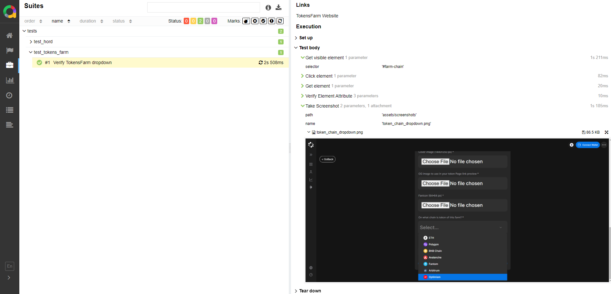
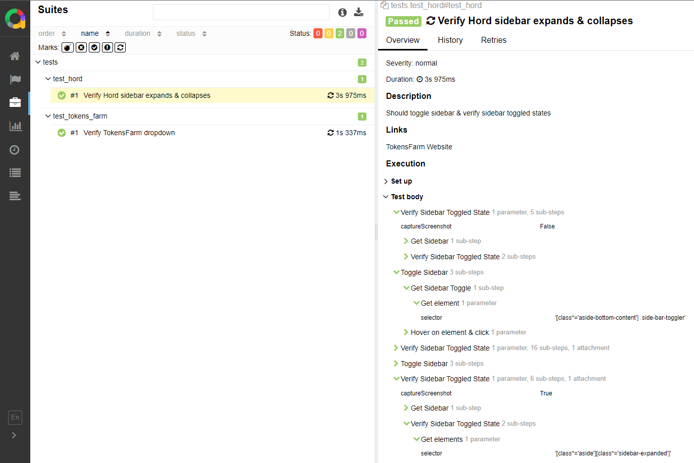

# DCentralLab-Selenium-Python-Demo

This project is a demonstration of an automation testing infrastructure Proof of Concept (POC) using the Page Object Model design pattern in Python.

[Full assignment document found here.](assets/assignment/DCentraLab%20-%20QA%20&%20Support%20Engineer%20-%20Home%20Assignments.md)

## Technology stack
* Selenium: Web browser automation tool.
* Python: Programming language used for scripting.
* PyTest: Testing framework for Python.
* Allure Reports: Reporting tool for test results visualization.

## Project structure
* `extensions`: Contains UI actions and verifications.
* `fixtures`: Initializes test functions.
* `locators`: Stores selectors for UI elements.
* `pages`: Represents web pages under test, holding page-specific functionality.
* `tests`: Contains test logic.
* `utils`: Includes `base.py` for global variables and common utilities like `screenshot.py`.
* `conftest.py`: Default configuration for pytest and global hooks.

## Manual Assignments
* [Brief explanation of Crypto concepts](manual/crypto_concepts.md) -
    - Blockchain
    - Smart contract
    - Bridge, 
    - GAS token, 
    - ERC-20 token, 
    - Wallet 
    - ChainPort bridge

* [Transaction history page tests suite](manual/transaction_tab_test_cases.md)
* [Porting fees protocols functional test cases](manual/porting_fees_protocols_test_cases.md) (Bonus task)

## Automation Assignments
* [TokensFarm app Element Locator](tests/test_tokens_farm.py)\
CSS Selector - `#farm-chain` or `[id='farm-chain']`\
XPATH Selector - `//*[@id='farm-chain']`

* [QA automation infrastructure project improvements](infra_improvements.md)

* [Hord app verify Sidebar](tests/test_hord.py)

## Run automation tests
* run `python -m pytest --alluredir allure-results` in the terminal to run the tests & generate allure reports.
* run `allure serve allure-results` in the terminal to open the report in a web browser.

## Estimated time worked on the project (hrs): 
~ 14 hrs