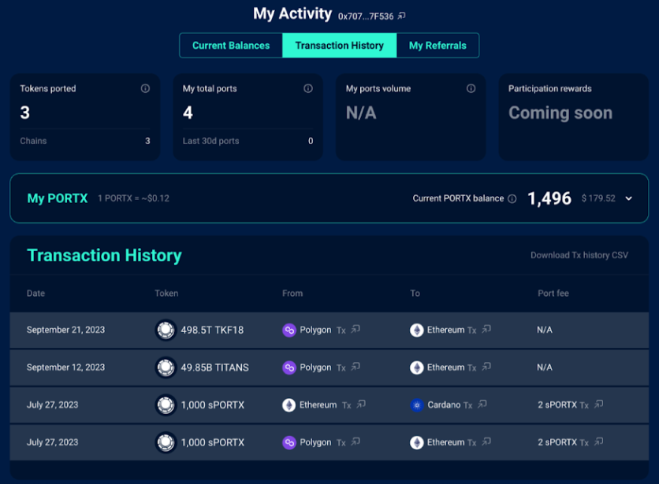
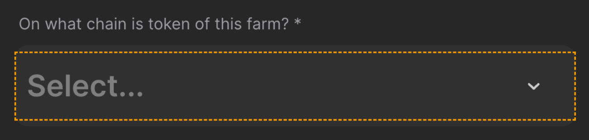
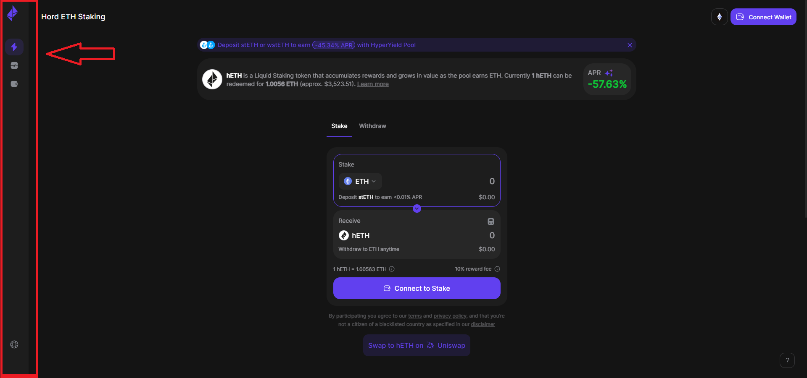
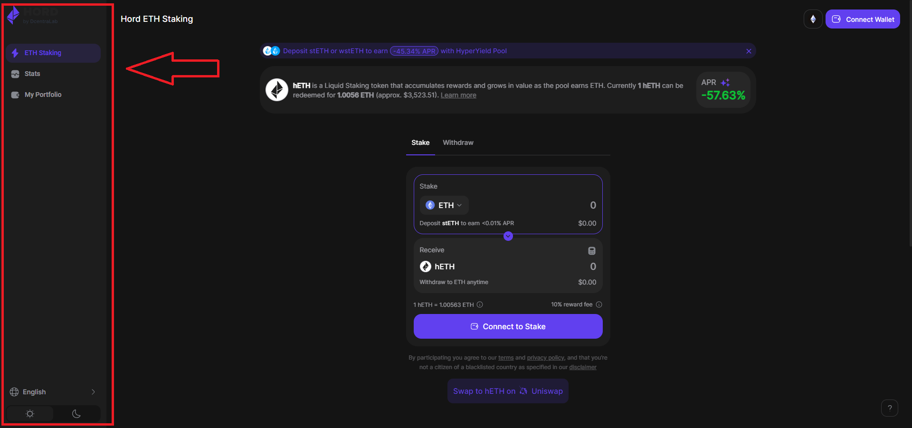

# DCentraLab - QA & Support Engineer - Home Assignment 

Hi, before starting, 
please get familiar with some main Crypto concepts:\
Blockchain, smart contract, bridge, GAS token, ERC-20 token, wallet and read about the [ChainPort bridge](https://www.chainport.io). 

- Explain in a few lines each one of the concepts above

### MANUAL Task
Write a TEST SUITE for a specific tab on the ChainPort App: **Transaction History**. 

The Transaction History Page contains the history of all ChainPort ports performed when connected with a specific account. In the screenshot example we are connected with a MetaMask wallet and viewing transactions from the account.

**Please write clear test cases**
If you see some bugs or issues in the screenshot, report them.\
To view this page : 
https://preprod.chainport.io/my-activity?currentTab=transaction_history\
NOTE: You may not see any transactions, even if you connect your wallet, when navigating to URL above

### Manual Task BONUS
Given 2 protocols – ChainPortX & CCTP where a threshold is implemented, provide a description of a minimal number of Functional Test Cases where the protocol and the fees taken are in it.\
NOTE: When amount to port is below or above the threshold-range CCTP is used as protocol.

Chains:  
ETHEREUM (ChainPortX & CCTP)\
AVALANCHE (CCTP)\
OPTIMISM (ChainPortX & CCTP)

### AUTOMATION Task → If you applied for Automation QA, follow the next 2 tasks

#### Task 1 - Find the element and write it in different formats:

URL: https://staging.tokensfarm.com/create#/staking

The element to find BY UNIQUE ID is the dropdown “On what chain is the token of this farm”
We are looking for the locator.

Write the element using CSS (HINT → There are 2 ways)\
Write the element using XPATH

#### Task 2 - You got access to 2 Repos: VERY IMPORTANT
**Auto Qa Infra (branch: DEVELOP)**: Here we would like you to list possible improvements.

**Automation Qa Tests Hord (branch: DEVELOP)**: Find the sidebar element and write a script that verifies if the sidebar is expanded with the elements you found.\
Elements, for both sidebar states, **must be written in CSS or XPATH**\
**Create a simple repository where files are properly organized**

**The script must be in python using Selenium webdriver and Pytest and the use of fixtures with a conftest file, and allure reports**\
URL: https://staging-app.hord.fi

NOTE: Many of the Web Applications are using SPA like React and elements can be dynamic depending on the state.
